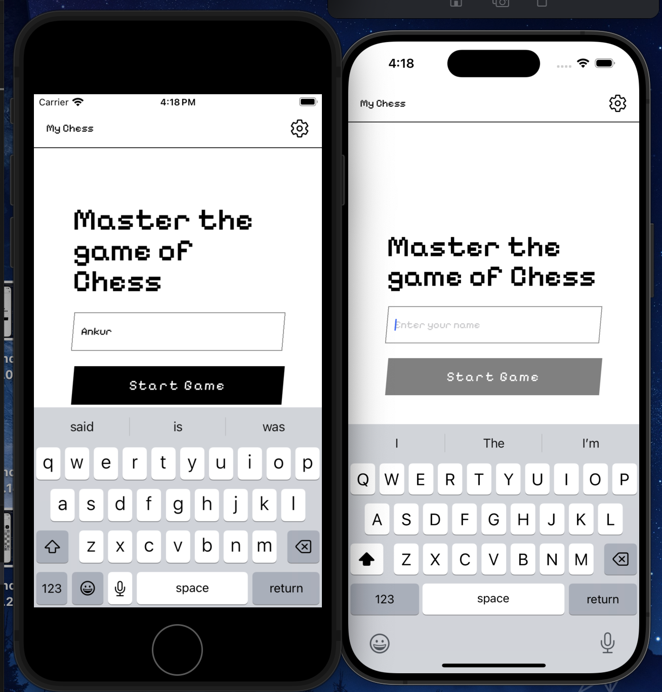
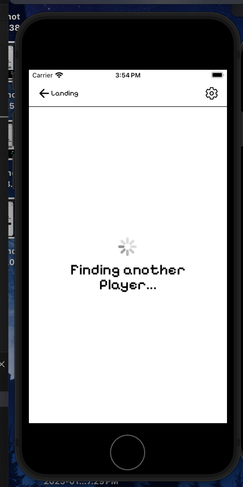
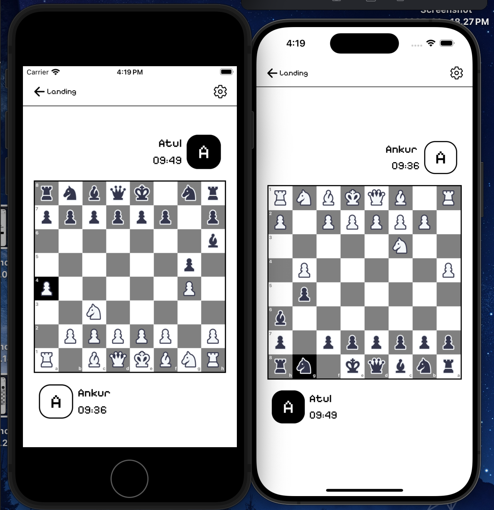
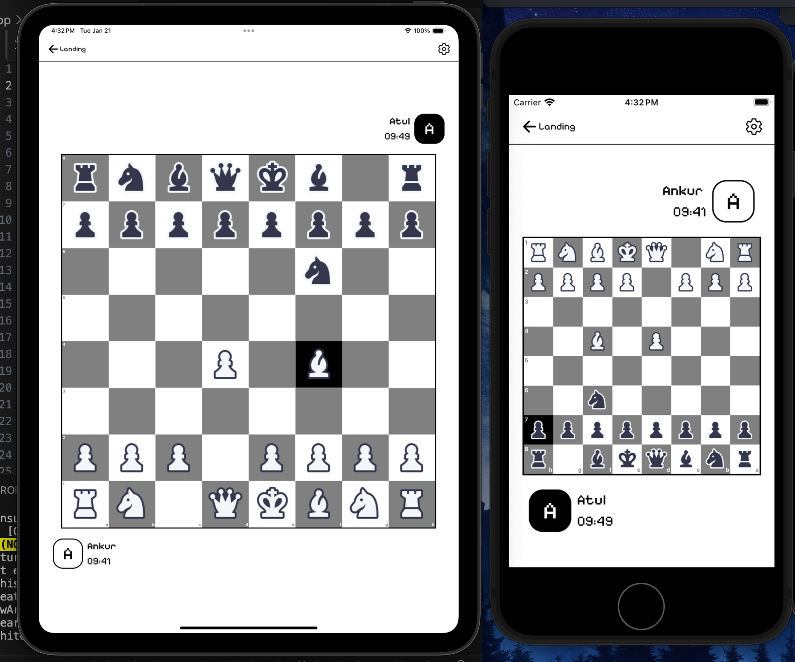
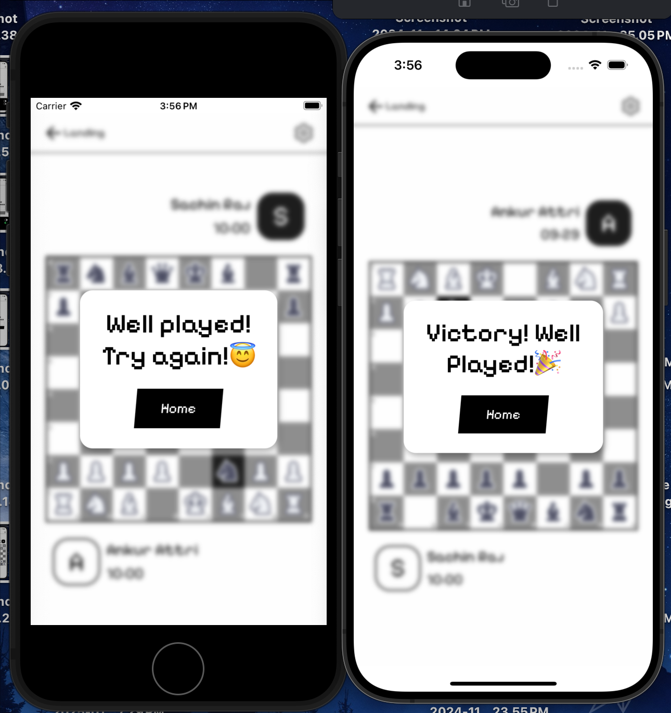

# Chess App Frontend

## Features

- **Real-time Multiplayer**: Play chess online with random opponents in real-time.
- **Minimalistic UI**: Designed with inspiration from the **Nothing** for a clean, modern aesthetic.
- **In-House Chess Logic**: Custom-built chess logic library for move validation, checks, checkmates, and more.
- **Sound Effects**: Integrated board piece movement sounds and background music to enhance user experience.
- **Responsive Design**: Fully optimized for various screen sizes, including tablets and smartphones.

---

## Installation

### Prerequisites
- **Node.js** (v14 or higher)
- **npm** (Node Package Manager)
- The backend server
   https://github.com/ankur874/Chess-BE

---

### Steps to Run Locally

1. **Clone the repository**:
   ```bash
   git clone https://github.com/ankur874/Chess-FE.git
   cd Chess-FE
2. **Install Dependencies**:
   ```bash
   npm install
3. **Start server**:
   ```bash
   npm start

## Images
     


